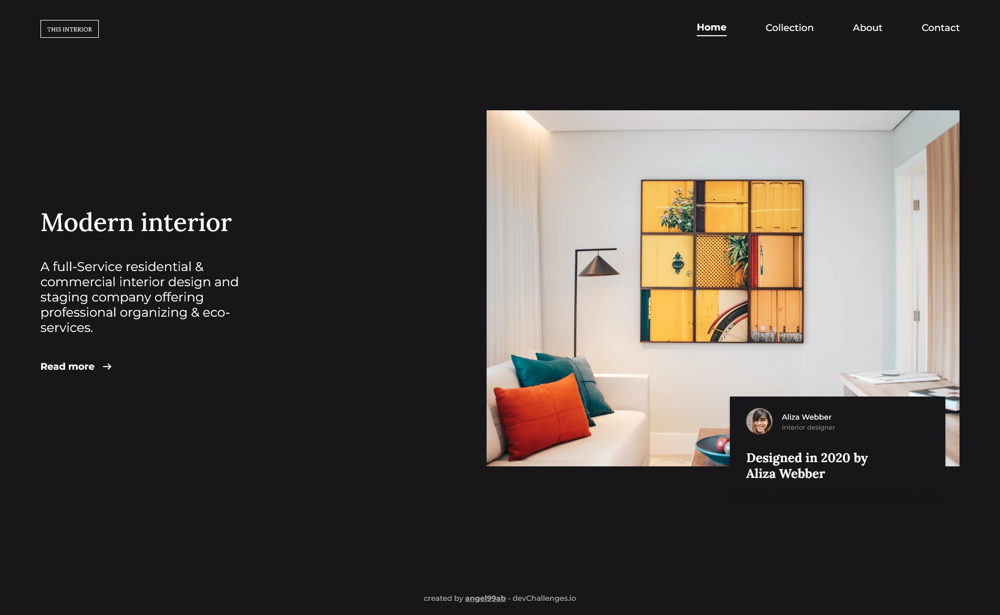

<div align="center">
  <h1>Interior consultant</h1>
</div>

<div align="center">
   Solution for a challenge from <a href="http://devchallenges.io" target="_blank">devChallenges.io</a>.
</div>

<div align="center">
  <h3>
    <a href="https://interior-consultant-eta.vercel.app">
      Demo
    </a>
    <span> | </span>
    <a href="https://github.com/angel99ab/devchallenges-projects/tree/master/interior_consultant">
      Solution
    </a>
    <span> | </span>
    <a href="https://devchallenges.io/challenges/Jymh2b2FyebRTUljkNcb">
      Challenge
    </a>
  </h3>
</div>

## Table of Contents

- [Overview](#overview)
  - [Built With](#built-with)
- [Features](#features)
- [How To Use](#how-to-use)
- [Acknowledgements](#acknowledgements)
- [Contact](#contact)

## Overview



A basic page showing the work of a designer using HTML and CSS from the Responsive Web Developer path.

- **Where can you see my demo?**

  The demo is live at [https://interior-consultant-eta.vercel.app](https://interior-consultant-eta.vercel.app).

- **What was my experience?**

  I took up this project as an opportunity to reinforce knowledge of HTML, CSS and a little bit of JavaScript.

- **What have I learned/improved?**

  I have learnt to use better the media queries to adapt my webpage to different screens.

### Built With

- [HTML](https://developer.mozilla.org/en-US/docs/Web/HTML)
- [CSS](https://developer.mozilla.org/en-US/docs/Web/CSS)
- [BEM](https://en.bem.info)

## Features

This application/site was created as a submission to a [DevChallenges](https://devchallenges.io) challenge. The [challenge](https://devchallenges.io/challenges/Jymh2b2FyebRTUljkNcb) was to build an application to complete the given user stories.

- **User story:** I can see a page following the given design
- **User story:** On mobile, I can see a collapsed navigation
- **User story:** On mobile, when I select the hamburger menu, I can see a navigation

## How To Use

To run this application you only need to clone the repository using [Git](https://git-scm.com). From your command line:

```bash
# Clone all the projects
$ git clone https://github.com/angel99ab/devchallenges-projects.git

# Enter in the folder
$ cd Interior_consultant/

# Open the index.html
```

## Acknowledgements

- [CSS-Tricks (flexbox)](https://css-tricks.com/snippets/css/a-guide-to-flexbox)
- [BEM info](https://en.bem.info)
- [Conventional commits](https://www.conventionalcommits.org/en/v1.0.0)

## Contact

- Website: [https://angel99ab.github.io](https://angel99ab.github.io)
- GitHub: [@angel99ab](https://github.com/angel99ab)
- Linkedin: [Angel Andrade Bergantiños](https://www.linkedin.com/in/angel-andrade-berganti%C3%B1os-3791a7176/)
